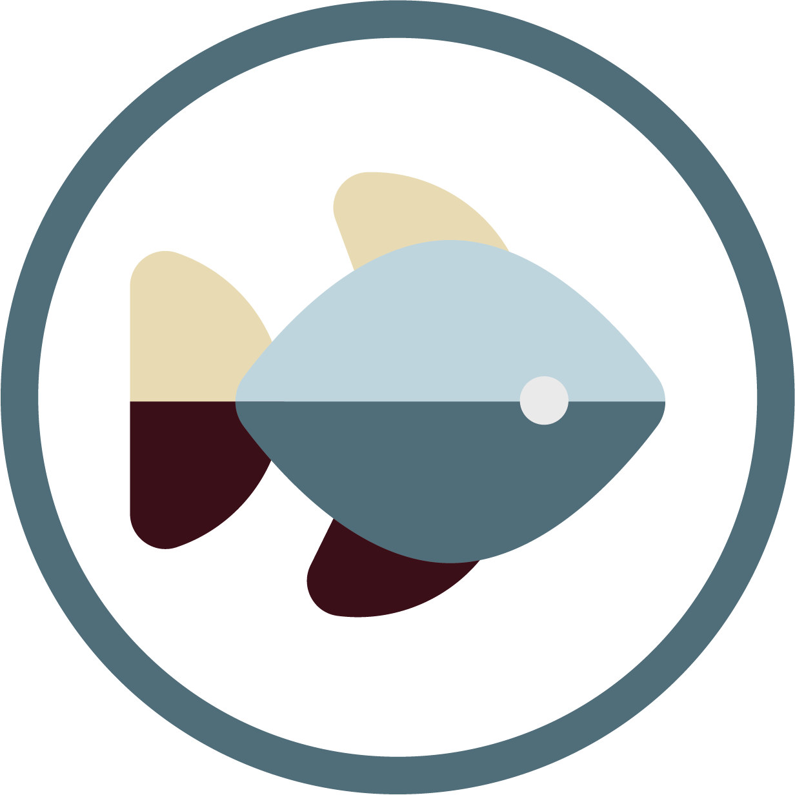
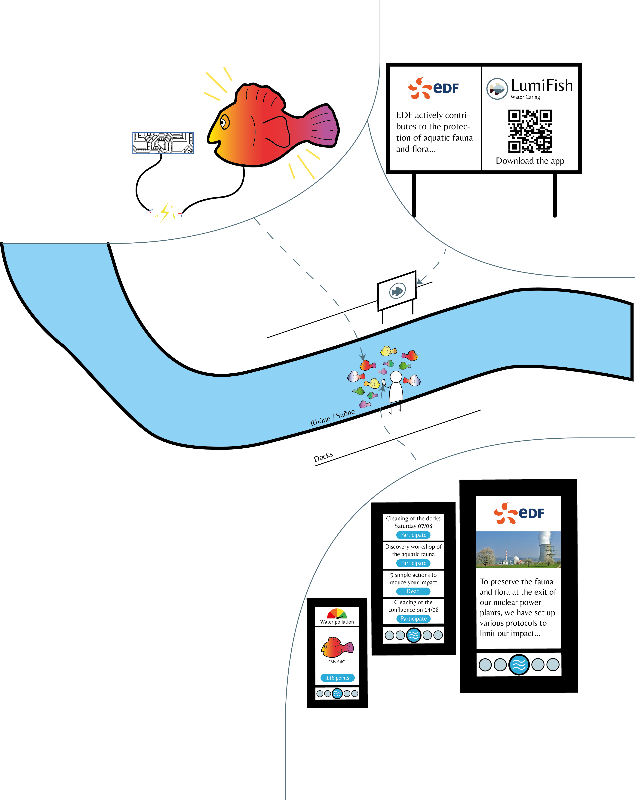

# LumiFish

The aquatic life of the waterways crossing Lyon is often forgotten since we see very little life from the surface. Our company Lumifish has been working on this problem. 
We have developed a solution to attract the eyes of passers-by to the water by creating a tourist attraction on the banks of the Rhône and Saône rivers. This installation is a school of luminous artificial fish, slightly immersed in the water and with which anyone can interact from the quay through a mobile application. The objective is to arouse the curiosity of passers-by and to mark the minds with an aesthetic and interactive installation. 
Our device can be rented by our clients, which will be companies whose objective is to make known their actions for the aquatic environment.

## What is it?

Here is a diagram of how our system works :

An informative panel placed on the quay on which is written a summary of our project, its objectives as well as the message wished by our customer. This panel also serves as a link between the physical installation and the mobile application since a flash code allows to download it directly.
The mobile application is the heart of our solution. Indeed, it offers several tabs:

* The home screen, presenting a virtual fish linked to a fish physically in the water. The objective is to create an emotional link between the fish and the user like a Tamagotchi.  A Tamagotchi is a Japanese virtual pet, created in 1996 by the Japanese company Bandai. This game consists of simulating the education of an animal with the help of a miniature console, the size of a watch, equipped with a computer program. Changing the color of your fish on the application has a direct impact on the appearance of the fish in the water.
* A screen reserved for associations and companies that act to depollute and preserve water allowing them to make articles, to invite people to participate in actions. If a user gets involved, he earns points that he can then exchange for promo codes or unlock new modes of lighting on the fish.
* A tab for using the points collected where the user can choose to use his points as he wishes.

### Documentation

Check our documentation :
- [Hackster.io](https://www.hackster.io/lumifish/projet-produits-ecole-ldlc-life-below-water-lumifish-e94007#things)
- [Website](https://gaelcourrege.wixsite.com/pp2021-vie-aquatique)
